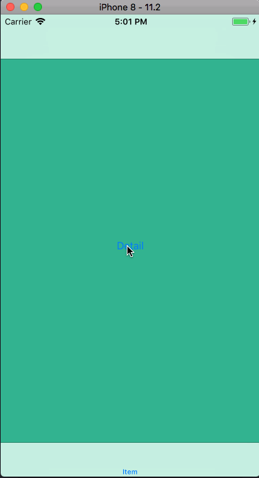
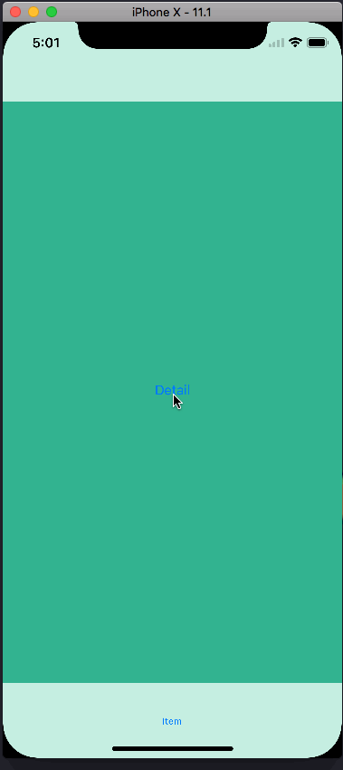
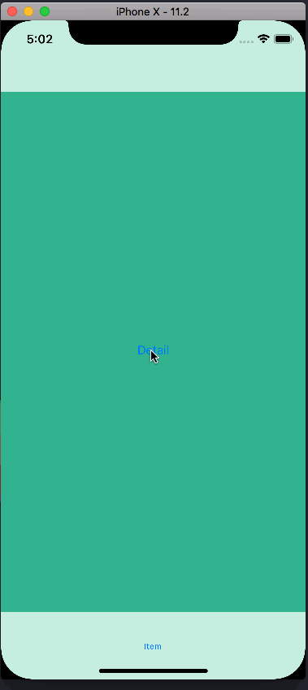

# HidesBottomBarWhenPushedSample

## iOS 11.2 / iPhone 8 👍

## iOS 11.1 / iPhone X 🤔
UITabBar shifts upward when **pushing** a view controller

## iOS 11.2 / iPhone X 🤔
The transition of the tab bar is not correct when **popping** a view controller

## Related pages
- [ios - Why page Push animation Tabbar moving up in the iPhone X - Stack Overflow](https://stackoverflow.com/questions/46232929/why-page-push-animation-tabbar-moving-up-in-the-iphone-x)
- [rdar://35098813: UITabBar shifts upward on iPhone X simulator when pushing a view controller with hidesBottomBarWhenPushed enabled](http://www.openradar.me/35098813)
- [rdar://35585928: UITabBar transition incorrect when using hidesBottomBarWhenPushed on iPhone X](https://openradar.appspot.com/35585928)
